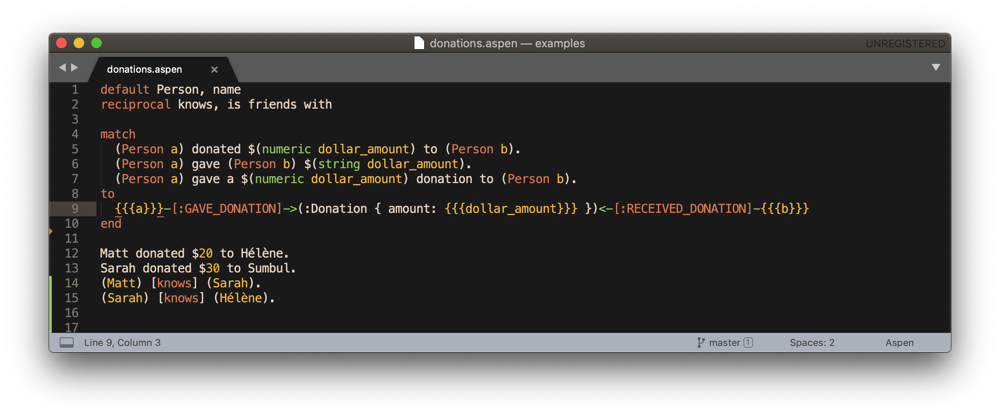

# Aspen - Sublime Text

A plugin for working with [Aspen](https://aspen-lang.org) in [Sublime Text](https://www.sublimetext.com/3).



## Installation

Clone this repository or copy the contents of Aspen.sublime-syntax to a file.

Move the Aspen.sublime-syntax file to

```
"/Users/{username}/Library/Application Support/Sublime Text 3/Packages/User/Aspen.sublime-syntax"
```

The plugin will detect files ending in .aspen as Aspen, or select Aspen from the Syntax menu (in the bottom-right corner).

## Future plans

- Making this available through Package Control.
- Snippets for common options (`default`, `match` , etc.).
- A build command that compiles Aspen to Cypher.
